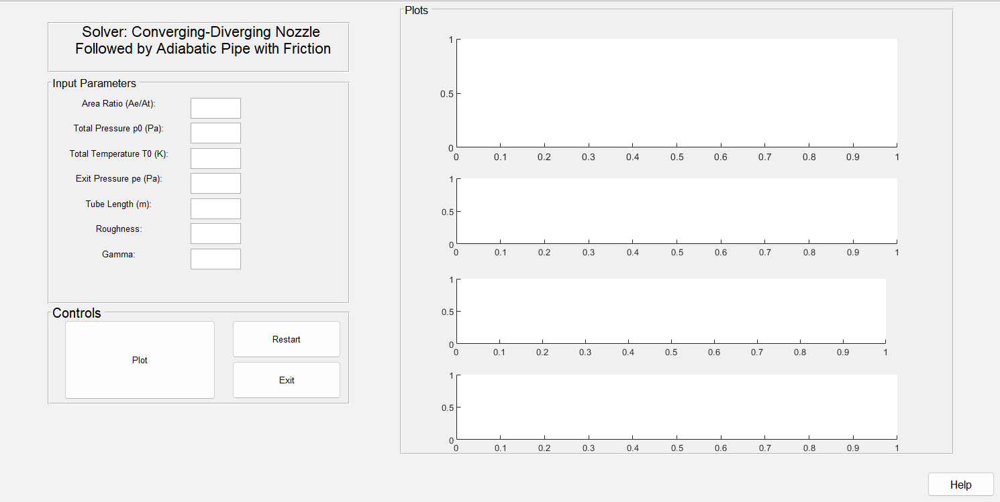

# 🚀 Quasi-1D Flow Simulator: CD Nozzle + Adiabatic Pipe with Variable Friction

This MATLAB-based tool simulates compressible quasi-1D flow in a **converging-diverging (CD) nozzle followed by an adiabatic pipe with variable friction**. The tool supports various flow conditions such as **subsonic, supersonic, shock transitions** scenarios, allowing deep exploration.

  

---

## 📦 Project Structure

- `Main_Solver/` — Contains the main GUI and solver to simulate full nozzle+pipe behavior.
- `First_Solvers/` — Contains standalone solvers for learning purposes:
  - **Adiabatic Frictionless Nozzle**
  - **Fanno Flow Pipe with Variable Friction**
- `Group_3_Report.pdf` — Complete academic report describing the project, equations used, and case studies.

---
## 📄 Report

To understand the derivation, equations, case classifications, and solver logic, refer to the included PDF:

📘 **[Group_3_Report.pdf](./Group_3_Report.pdf)**

---
## ✨ Features

- Interactive **MATLAB GUI** for user-friendly parameter input.
- Visualizes **Mach number, temperature, and pressure** along the nozzle and pipe.
- Handles various conditions described in the Report
- Includes **variable friction effects** using the **Churchill correlation**.
---

## 🧪 How to Use

1. Open MATLAB and navigate to the corresponding folder.
2. Run `GUI_Main.m` from either:
   - `Main_Solver/` (for full nozzle + pipe solver)
   - `First_Solvers/` (for simpler solvers)
3. Enter parameters (e.g., stagnation pressure, temperature, pipe length, etc.).
4. Click **Plot** to view results, or use **Help** for guidance.

> 💡 Ensure the *Optimization Toolbox* is installed for `fzero()` and `fsolve()` to work.

---

## 📊 What You’ll See

- Nozzle and pipe geometry
- Plots of **Mach number**, **temperature**, and **pressure** profiles
- Shock and expansion wave visualization
- Friction variation vs Reynolds number

---

## 👨‍🔬 Authors

- Eduardo De Almeida Helena
- Rafael Coimbra Azeiteiro
- Elena Francesca Cipriano
- João Pedro Almeida

Supervised by **Prof. José Manuel Chaves Ribeiro Pereira**

---

## 📚 References

- John D. Anderson, *Modern Compressible Flow*, 3rd ed., McGraw-Hill, 2004.
- Class notes from *Aerodynamics III*, IST - ULisboa.

---

